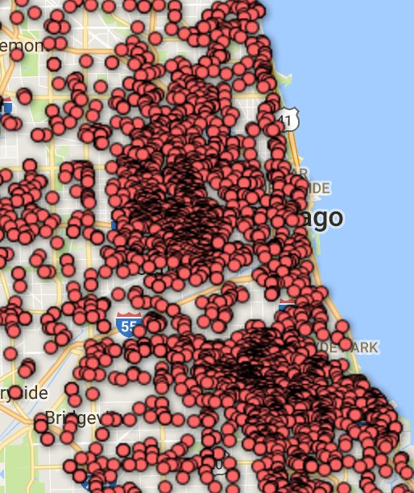

:title: Lucy Parsons Labs
:author: b_meson
:description: LPL public meeting
:keywords: activism, transparency, 
:css: se.css

----

.. image:: images/lpl-logotransp.png

``@B_meson`` for Lucy Parsons Labs (``@lucyparsonslabs``)

----

Who was Lucy Parsons?
=====================

She was a famous labor organizer and anarchist in Chicago during the late 19th century. Once described as "more dangerous than a thousand rioters" by Chicago Police and helped found the Industrial Workers of the World (IWW), a major labor union. Recommend reading the book "An American Revolutionary" by Carolyn Ashbaugh on her life.

----

Our Mission
===========

The Lucy Parsons Labs is a Chicago-based collaboration between data scientists, transparency activists, and technologists which focuses on the intersection of digital rights and on-the-streets issues

----

Current Projects
================

----

.. image:: images/reader_cover.png

----

* Audit of CPD's civil asset forfeiture program (1505)
  
  - All amounts over $5,000 since 2009: Accounted for millions of dollars of seized money 
 
----

----

OpenOversight
=============

* Many complaints are thrown out due to no badge number or name being associated with a complaint 

* Want to build a tool to help people identify officers when filing police complaints

* Accomplish this through a database of officers and photos constructed through public data

* Web application with two use cases: Complainants use to construct a digital line up to find the officer, people submit new images of officers to keep the data up to date 

----

* Redesigned the UI / UX
* Native upload to S3
* Leaderboard
* Rapid sorting

----

.. image:: images/securedrop-logo.png

* An anonymous whistleblowing system that:

  - Runs as a Tor Hidden Service for source anonymity

  - Does not log data about your browser, device, etc.

  - Encrypts submissions in transit and rest

* We deployed this at: https://lucyparsonslabs.com/securedrop

----

.. image:: images/securedrop_leak2.png

----

Public Events
=============

* CYBERWAR
* Buzzfeed x OpenNews Document Sprint
* DeleteUrAccount Podcast
* Northwestern 
* Allied Media Conference

----

Work in Progress
================

* Stop and Frisk Data analysis

* Data-sharing group with DatamadeCo, II, etc. 

* "Call Back Unit" data

* FOIA lawsuits around "Suspicious Activities Reports"

----

Administrative
==============

.. image:: images/business.jpg

----

 * ~2,600 in donations 
 * Webpage redesign (~1,000)
 * Business Plan complete

----

Ways to Get Involved
====================

  - We need help doing press releases, social media posts, making
    stickers/posters (#propaganda)

  - If you have development skills for OpenOversight, get in touch! Also, take some OO handouts.

