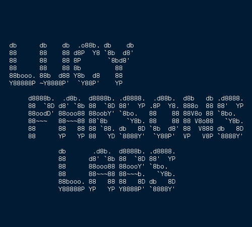
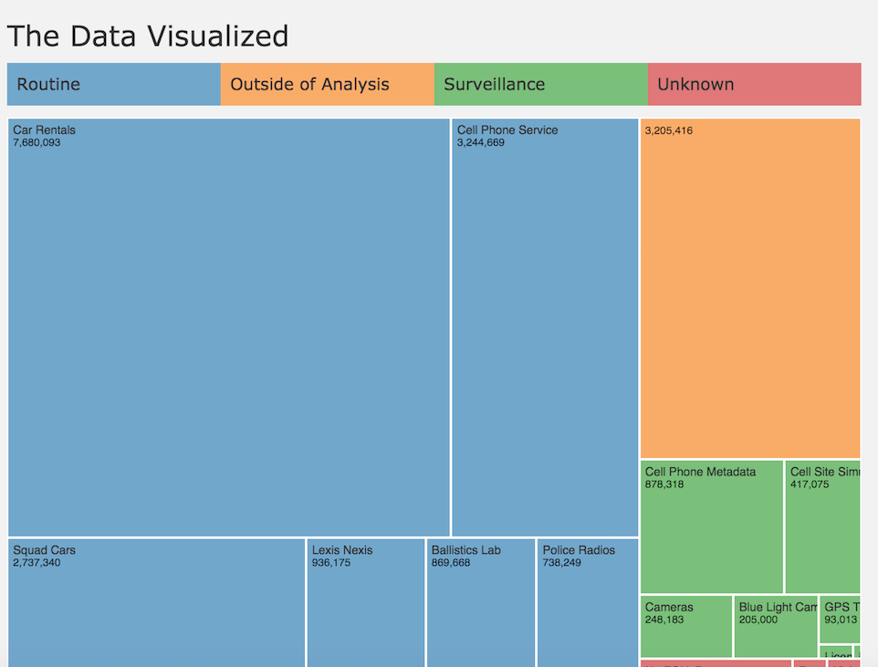
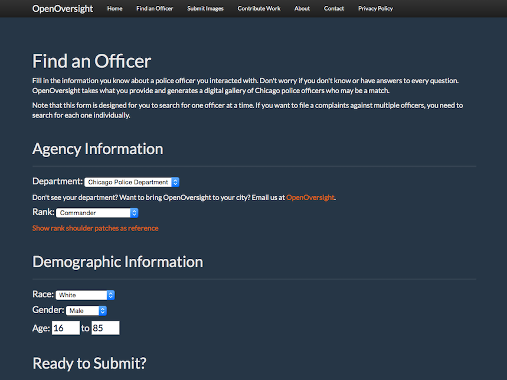
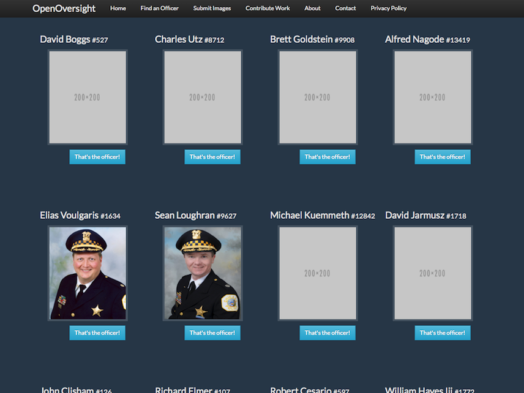
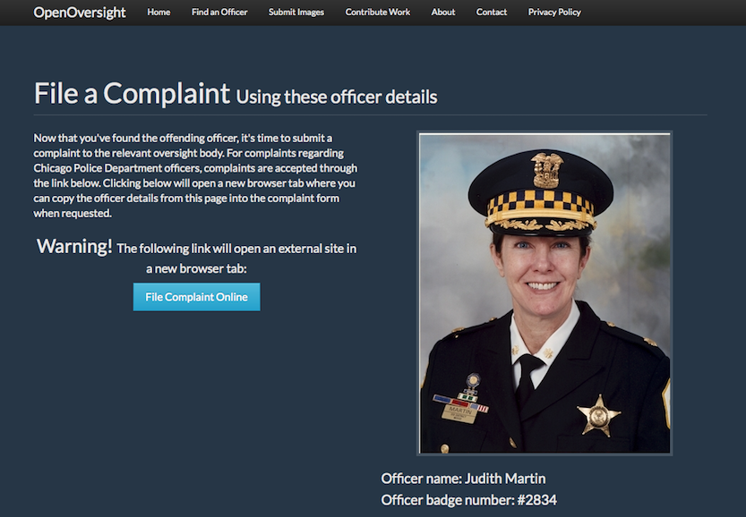

:title: Lucy Parsons Labs
:author: redshiftzero, b_meson
:description: LPL public meeting
:keywords: activism, transparency, 
:css: oo.css

----

``@redshiftzero`` & ``@B_meson`` & ``@r4v5`` & ``@cipherguerrilla`` for Lucy Parsons Labs (``@lucyparsonslabs``)

----

Who was Lucy Parsons?
=====================

She was a famous labor organizer and anarchist in Chicago during the late 19th century. Once described as "more dangerous than a thousand rioters" by Chicago Police and helped found the Industrial Workers of the World (IWW), a major labor union. Recommend reading the book "An American revolutionary" by Carolyn Ashbaugh on her life.

----

Our Mission
===========

The Lucy Parsons Labs is a Chicago-based collaboration between data scientists, transparency activists, and technologists which focuses on the intersection of digital rights and on-the-streets issues

----

Current Projects
================

----

.. image:: images/reader_cover.png

----

.. image:: images/muckrock.png

* Audit of CPD's civil asset forfeiture program (1505)
  
  - Front page story published in the Chicago Reader with Joel Handley 
  
  - All amounts over $5,000 since 2009: Accounted for millions of dollars of seized money 
 
  - Funds used to pay for day to day operations of war on drugs but also for surveillance devices like ALPR 

----

----

After Publishing
================

* Lots of great Press Release and feedback.

  - Story was shared/read by Equal Future, Ford Foundation, other NFPs

* Since we don't log our traffic data its hard to see visitor numbers 😭 
* City Council has made noise about taking the fund away from BOC. 
* Read full story in Chicago Reader or https://lucyparsonslabs.com/fullaudit

----

OpenOversight
=============

* Many complaints are thrown out due to no badge number or name being associated with a complaint 

* Want to build a tool to help people identify officers when filing police complaints

* Accomplish this through a database of officers and photos constructed through public data

* Web application with two use cases: Complainants use to construct a digital line up to find the officer, people submit new images of officers to keep the data up to date 

----

----

----

----

PoC || GTFOH
============

----

* Added a new theme
* Backend / database improvements 
* Need UI/UX support 
* Unit tests needed and integration testing
* Sending this week to journalists

----

.. image:: images/securedrop-logo.png

* An anonymous whistleblowing system that:

  - Runs as a Tor Hidden Service for source anonymity

  - Does not log data about your browser, device, etc.

  - Encrypts submissions in transit and rest

* We deployed this at: https://lucyparsonslabs.com/securedrop
* Help wanted advertising

----

.. image:: images/securedrop_leak2.png

----

Miscellaneous
=============

* CPD FOIA Database Analysis
* https://www.youtube.com/watch?v=IofBrfP0ve8
* Signed! Stingray Warrant Requirement Bill:  https://lucyparsonslabs.com/stingray/stingraybill/
* Stingray deployment statistics 
* Talk at ChiHackNight (again)

----

New Projects
============

* Investigating new surveillance techniques like CVE, SMINT

  - Security Trainings with targeted groups

* Propaganda / SecureDrop outreach 

* Chicago Bond Fund reached out about possible technical mutual aid they need

----

Organization Things
===================
* Applying for 501c3 non profit status

  - Allow us to write letters on behalf of people who have been arrested to judges

----

Ways to Get Involved
====================

  - Planning events and doing outreach

  - We need help doing press releases, social media posts, making
    stickers/posters (#propaganda)

  - If you have development skills for OpenOversight, get in touch!

  - If you're a journalist or know people who can help us dig through documents

  - Give us your email, join us on slack, we can add you to our public Trello
 
  - Lots of manual sorting for OpenOversight, we need help!

----  

ACKs
====

Many thanks are needed to many people but in particular: Joel Handley, Robin Amer (Editor @ Reader), Dan M, UnrealAdam, John B (FOIA Commander), Candice, John O and Audrey H.
